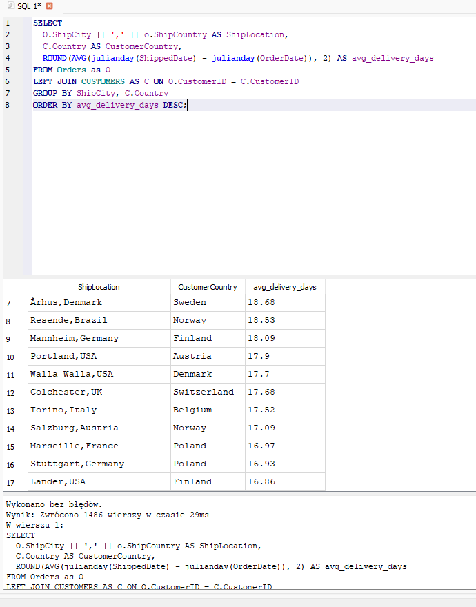
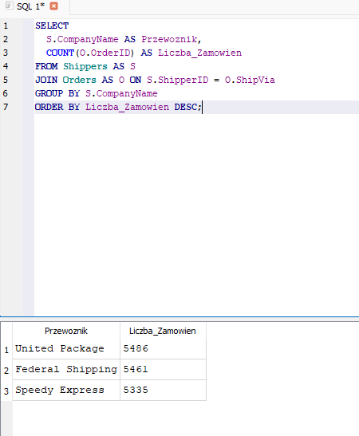
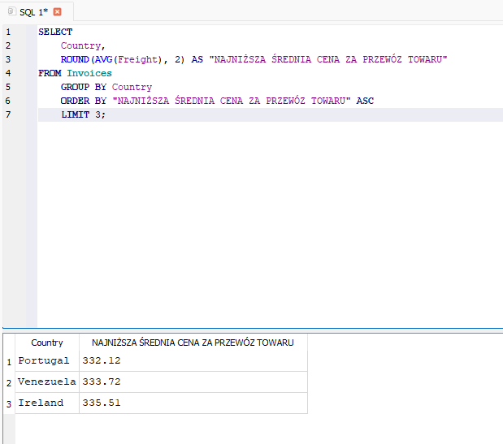

##  Analiza logistyczna danych Northwind

   Ten projekt łączy moje rzeczywiste doświadczenie w branży logistycznej oraz ukończone studia magisterskie z Logistyki Międzynarodowej z praktyką analizy danych w SQL. Miałam okazję pracować jako specjalistka ds. obsługi klienta w jednym z największych terminali przeładunkowych na Warmii i Mazurach, gdzie zajmowałam się m.in. fakturowaniem, sprzedażą i dystrybucją ekogroszku oraz obsługą stanów magazynowych. Dzięki pracy z systemami takimi jak Symfonia i bezpośrednim kontaktem z klientami, dobrze rozumiem wyzwania i specyfikę logistyki operacyjnej.
   W tym projekcie pokazuję, jak można przeanalizować dane zamówień pod kątem efektywności dostaw i kosztów transportu — i jak można wykorzystać wiedzę logistyczną w pracy analitycznej.

## Cel 

  Zbadać czas realizacji zamówień, koszty dostawy oraz produktywność operacyjną – z perspektywy logistyki i analityki danych.

## Dane
Źródło: Northwind SQLite

## Kluczowe metryki:
- Średni czas dostawy (ShippedDate - OrderDate)
- Top kraje pod względem kosztu dostawy ('Freight')
- Przewoźnicy i ich wydajność
- Produkty najczęściej zamawiane do krajów z wysokim średnim kosztem frachtu

## 📊 Przykładowe wyniki zapytań

**Średni czas dostawy do lokalizacji:**  

**Liczba zamówień obsłużona przez przewoźników:**  

**Top 3 kraje z najniższym średnim kosztem frachtu:**  

## Technologie
SQLite, SQL, DB Browser, Excel/Power BI

* Uwagi osobiste

   To mój pierwszy projekt łączący logistykę i analizę danych. Praca nad nim pomogła mi przekuć wcześniejsze doświadczenie zawodowe w umiejętności techniczne, które mogę teraz rozwijać jako przyszła analityczka danych.
